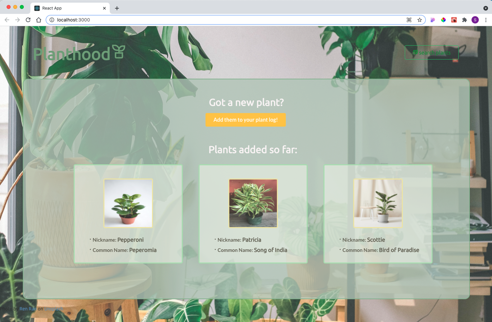
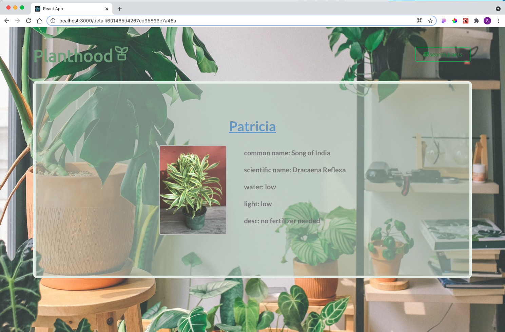

# Planthood
A simple journaling app to help users keep track of their existing plants that has a built-in search box to directly search from a plant API (trefle API)

* Can browse plants that are already added to the database
* Can add new plants and upload photos of the new plants
* Can display the details of each plant from database
* (WIP) Trefle API is no longer available; search feature will be replaced with another plant API soon

